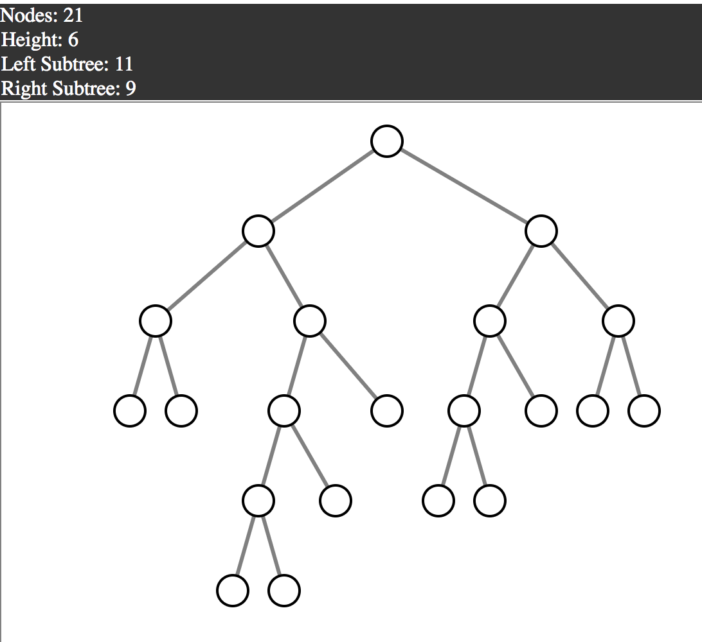
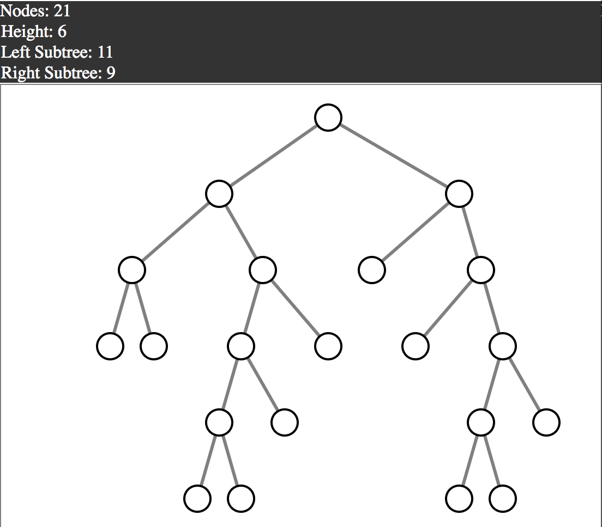

# Count Strict Binary Trees
Farmer John is keeping track of his cows' pedigrees. He starts with one cow, and his cows only give birth to twins. After K generations of cows, Farmer John now has N cows. How many different pedigrees are possible? A pedigree is considered unique if its tree structre is unique.

# Breakdown

This is an enumeration problem, counting the different unique structures of strict binary trees given N nodes and tree height K.

* Strict binary tree = every non-leaf node has two children

First consider only N cows (no height restriction). To count number of trees for N nodes: Remove one node, this is the root for our right & left subtrees.

With remaining N-1 nodes, divide them between left and right subtrees

* Each subtree must get an odd number of nodes

These are the different possible combinations of left subtree & right subtree for a tree with total 11 nodes:

    LHS   RHS
    1     9
    3     7
    5     5
    7     3
    9     1

To count the number of tree structures possible in both left and right subtrees, we recurse, placing one node and once again dividing the remaining nodes between (2nd generation) left & right subtrees. Notice in the example below, the numbers are referring to how many nodes are contained in the respective subtree.

    Example: n = 11
      x         x         x         x         x
     / \   +   / \   +   / \   +   / \   +   / \
    1   9     3   7     5   5     7   3     9   1

    f(11) = f(1)*f(9) + f(3)*f(7) + f(5)*f(5) + f(7)*f(3) + f(9)*f(1)

    Recurse: n = 9
      x         x         x         x
     / \   +   / \   +   / \   +   / \
    1   7     3   5     5   3     7   1

    f(9) = f(1)*f(7) + f(3)*f(5) + f(5)*f(3) + f(7)*f(1)

For each pair of sizes of LHS and RHS subtrees, there are three cases to consider:
1. Only LHS reaches the full height of the tree

2. Only RHS reaches the full height of the tree

3. Both LHS & RHS reach full height of tree

